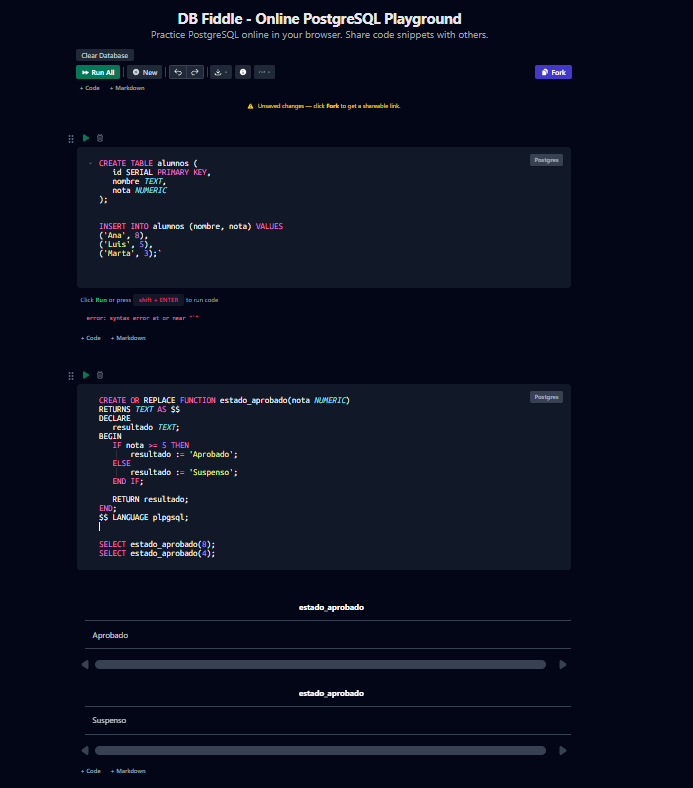
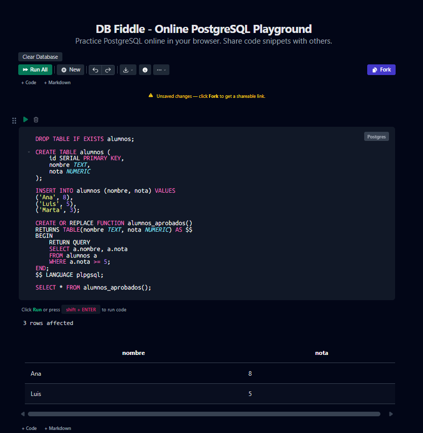
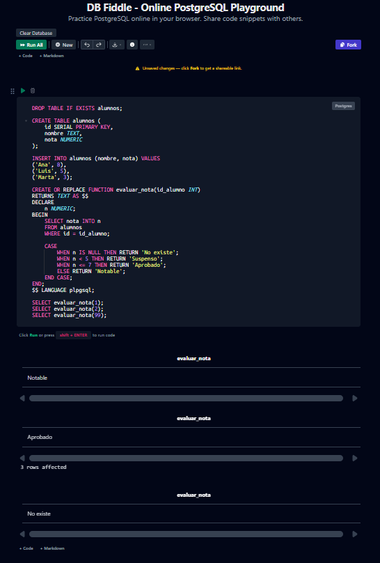

# Funciones y Procedimientos Almacenados en PostgreSQL con PL/pgSQL

## 1. Introducción

En este documento se implementarán funciones de pgsql que permitan determinar si un alumno está aprobado o suspendido, consultar alumnos aprobados y evaluar su situación académica. Para ello se utilizarán variables, estructuras condicionales, bucles y manejo de resultados aplicados sobre tablas reales.

---

## 2. Creación de tablas

Se crea una tabla para almacenar alumnos y sus notas:

```sql
CREATE TABLE alumnos (
   id SERIAL PRIMARY KEY,
   nombre TEXT,
   nota NUMERIC
);
```

### Inserción de datos

```sql
INSERT INTO alumnos (nombre, nota) VALUES
('Ana', 8),
('Luis', 5),
('Marta', 3);
```

### Explicación técnica

Se crea una tabla básica con identificador automático (`SERIAL`) y se insertan datos para probar las funciones.

---

## 3. Función 1: Función escalar

Devuelve si un alumno está aprobado o suspenso.

```sql
CREATE OR REPLACE FUNCTION estado_aprobado(nota NUMERIC)
RETURNS TEXT AS $$
DECLARE
   resultado TEXT;
BEGIN
   IF nota >= 5 THEN
       resultado := 'Aprobado';
   ELSE
       resultado := 'Suspenso';
   END IF;

   RETURN resultado;
END;
$$ LANGUAGE plpgsql;
```

### Ejecución

```sql
SELECT estado_aprobado(8);
```

### Resultado esperado
Aprobado

### Explicación técnica

- Se usa `IF` / `ELSE`
- Se declara una variable (`resultado`)
- Se devuelve un valor con `RETURN`

---

## 4. Función 2: Función que devuelve tabla

Devuelve los alumnos aprobados.

```sql
CREATE OR REPLACE FUNCTION alumnos_aprobados()
RETURNS TABLE(nombre TEXT, nota NUMERIC) AS $$
BEGIN
   RETURN QUERY
   SELECT a.nombre, a.nota
   FROM alumnos a
   WHERE a.nota >= 5;
END;
$$ LANGUAGE plpgsql;
```

### Ejecución

```sql
SELECT * FROM alumnos_aprobados();
```

### Resultado esperado
Ana   | 8
Luis  | 5

### Explicación técnica

- Uso de `RETURNS TABLE`
- Uso de `RETURN QUERY` para devolver varias filas

---

## 5. Función 3: Lógica compleja

Evalúa la nota de un alumno y devuelve un mensaje más detallado.

```sql
CREATE OR REPLACE FUNCTION evaluar_nota(id_alumno INT)
RETURNS TEXT AS $$
DECLARE
   nota_alumno NUMERIC;
   mensaje TEXT;
BEGIN
   SELECT nota INTO nota_alumno
   FROM alumnos
   WHERE id = id_alumno;

   CASE
       WHEN nota_alumno IS NULL THEN
           mensaje := 'Alumno no encontrado';
       WHEN nota_alumno < 5 THEN
           mensaje := 'Suspenso';
       WHEN nota_alumno BETWEEN 5 AND 7 THEN
           mensaje := 'Aprobado';
       ELSE
           mensaje := 'Notable o sobresaliente';
   END CASE;

   RETURN mensaje;
END;
$$ LANGUAGE plpgsql;
```

### Ejecución

```sql
SELECT evaluar_nota(1);
```

### Resultado esperado
Notable o sobresaliente

### Explicación técnica

- Uso de `SELECT INTO`
- Uso de `CASE`
- Evaluación de múltiples condiciones

---

## 6. Uso de bucles

Ejemplo con `WHILE` y `FOR`:

```sql
DO $$
DECLARE
   i INT := 1;
BEGIN
   WHILE i <= 3 LOOP
       RAISE NOTICE 'Iteración WHILE: %', i;
       i := i + 1;
   END LOOP;

   FOR i IN 1..3 LOOP
       RAISE NOTICE 'Iteración FOR: %', i;
   END LOOP;
END;
$$;
```

### Resultado esperado
Iteración WHILE: 1
Iteración WHILE: 2
Iteración WHILE: 3
Iteración FOR: 1
Iteración FOR: 2
Iteración FOR: 3

### Explicación técnica

- `WHILE`: repite mientras se cumpla la condición
- `FOR`: recorre un rango de valores
- `RAISE NOTICE`: muestra mensajes en consola

---

## 7. Procedimiento almacenado

Actualiza las notas de todos los alumnos y añade uno nuevo.

```sql
CREATE OR REPLACE PROCEDURE actualizar_notas()
LANGUAGE plpgsql
AS $$
BEGIN
   UPDATE alumnos
   SET nota = nota + 1;

   INSERT INTO alumnos (nombre, nota)
   VALUES ('Nuevo Alumno', 6);
END;
$$;
```

### Ejecución

```sql
CALL actualizar_notas();
```

### Verificación

```sql
SELECT * FROM alumnos;
```

### Explicación técnica

- Se usa `UPDATE` para modificar datos
- Se usa `INSERT` para añadir registros
- Se ejecuta con `CALL` (no devuelve valor)

---

## 8. Validación en psql

### Ejecutar el archivo

```bash
psql -U tu_usuario -d tu_base -f archivo.sql
```

### Comprobar funciones

```sql
SELECT estado_aprobado(4);
SELECT * FROM alumnos_aprobados();
SELECT evaluar_nota(2);
```

### Verificar cambios

```sql
SELECT * FROM alumnos;
```

---

### Validaciones:

A continuación validamos que todo funcione en db fiddle, un simulador de prostgresql que admite funciones con psql:

Funcion estado_aprobado:



Funcion alumnos_aprobados:



Funcion evaluar_nota:


